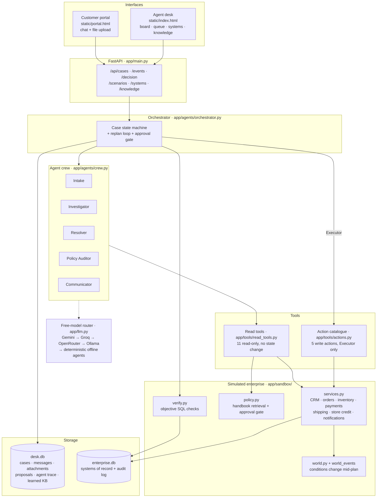
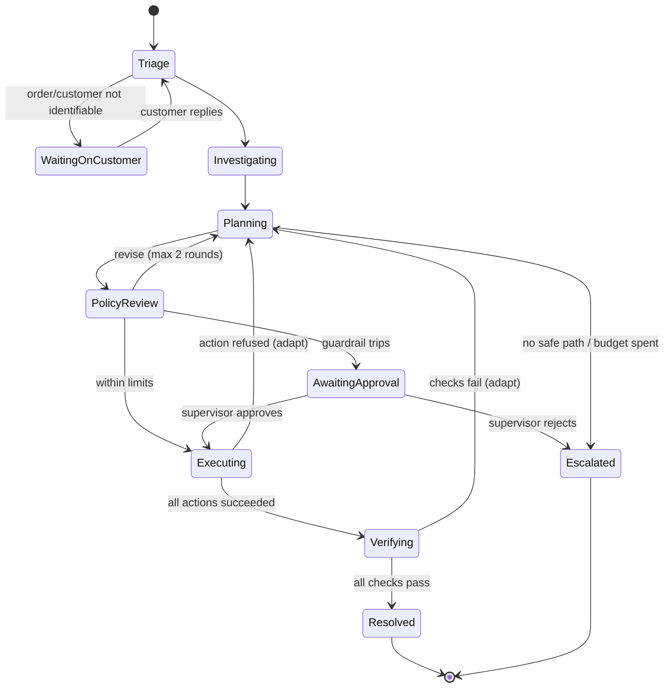

# CasePilot - System Architecture

CasePilot is an autonomous customer-resolution agent that lives inside a support desk. A customer
files a case in plain language; a crew of five agents reads it, investigates the enterprise systems
of record, plans a resolution against a policy handbook, gets it past a deterministic guardrail,
executes real state changes, **verifies them against the database**, and adapts when the world
changes underneath it.

The loop is **observe → decide → act → verify → adapt**, and the verify step is objective: a case is
resolved only when SQL queries against the systems of record agree with what the agent promised.

---

## 1. Big picture



**Two databases, deliberately separate.** `desk.db` is the ticketing product (what a support tool
owns). `enterprise.db` is the company the agent acts on (CRM, orders, inventory, payments, shipping).
The agent can only touch the second one through tools, and the verifier reads it directly — so
verification cannot be fooled by an agent that merely *claims* success.

---

## 2. The resolution loop



Budgets live in `app/config.py`: `MAX_AGENT_STEPS = 12` tool calls per agent run,
`MAX_AUDIT_ROUNDS = 2` resolver↔auditor revisions, `MAX_REPLANS = 3` plan→execute→verify cycles
before the case escalates with everything it learned attached.

Each case runs on its own daemon thread (`_spawn`), guarded by a `_running` set so a case can never
be processed twice concurrently. Any uncaught exception escalates the case with a trace rather than
leaving it stuck.

---

## 3. The agent crew

Every agent is the same shape — prompt + tools + a pydantic output schema + a deterministic
fallback — implemented once in `app/agents/base.py` as a ReAct-style tool-calling loop.

| Agent | Job | Tools it may call | Returns |
|---|---|---|---|
| **Intake** | Map a plain-language message to a goal, customer and order; set priority; ask one clarifying question if the case is unworkable | `find_customer`, `get_customer`, `get_order`, `get_today`, `get_case_conversation`, `inspect_attachment` | `Intake` |
| **Investigator** | Gather evidence across the systems of record and list which resolutions are *eligible*, each with a policy reference | `get_customer`, `get_order`, `track_shipment`, `check_inventory`, `search_policy`, `search_past_cases`, `get_today`, `payment_gateway_status` + case tools | `Facts` |
| **Resolver** | Choose one option and emit a concrete action plan with an **expected outcome** | `get_order`, `check_inventory`, `track_shipment`, `search_policy`, `get_customer`, `get_today` | `Plan` |
| **Policy Auditor** | Independently re-check the plan against the handbook and send it back with specific feedback | `search_policy`, `get_order`, `get_customer`, `check_inventory`, `track_shipment` | `Review` |
| **Communicator** | Write the customer reply and the internal note, and distil the case into a knowledge-base entry | none (writing only) | `Reply` |

Schemas live in `app/agents/schemas.py`; prompts are plain Markdown in `app/agents/prompts/`, so
they can be edited without touching code.

**The Resolver never executes.** It proposes typed actions; the orchestrator's Executor is the only
code path that calls a write service.

**The Auditor is a real check, not a rubber stamp.** If it never approves within
`MAX_AUDIT_ROUNDS`, the orchestrator returns a hard-coded escalation `Plan` — an unapproved plan is
structurally unable to reach the Executor.

---

## 4. Tools

**Read tools (11, `app/tools/read_tools.py`)** — none of them change state, so the model is free to
explore. Service refusals are wrapped by `_safe()` and returned to the model *as data*, so a refusal
is information the agent reasons about instead of a crash.

`find_customer` · `get_customer` · `get_order` · `check_inventory` · `track_shipment` ·
`payment_gateway_status` · `search_policy` · `search_past_cases` · `get_today` ·
`get_case_conversation` · `inspect_attachment`

`inspect_attachment` is multimodal: an image attachment (a photo of a damaged item) is sent to the
vision-capable free model to be described; a text attachment is read directly. If no vision model is
reachable it says so rather than inventing a description.

**Write actions (5, `app/tools/actions.py`)** — a small typed catalogue rendered into the Resolver's
prompt and validated before the auditor ever sees the plan. `validate()` rejects unknown actions and
missing params, sending the Resolver back with the exact errors.

| Action | Guarantee enforced in the service layer |
|---|---|
| `refund` | Never more than captured minus already refunded; idempotency key per attempt |
| `create_replacement` | Must reserve real stock; fails `OUT_OF_STOCK` if the warehouse is empty |
| `create_return_label` | Prepaid label as a `return` shipment |
| `cancel_order` | Fails `ORDER_ALREADY_SHIPPED` once the carrier has picked up |
| `issue_store_credit` | Bound to a case reference under POL-GW-1 |

---

## 5. Verification - why "done" means something

`app/sandbox/verify.py` takes the plan's `expected` outcome and runs SQL against `enterprise.db`:

- `refund_posted` — succeeded refunds sum to the promised amount (excluding cancellation refunds)
- `order_cancelled` — order status really is `cancelled`
- `replacement_shipment` — a `replacement` shipment for that SKU exists
- `arrives_by_need_by` — its ETA actually meets the customer's deadline
- `return_label_issued` · `store_credit_issued`
- `no_over_refund` — an invariant checked on **every** case: refunded ≤ captured
- `customer_notified` — a notification row exists (final pass only)

A failed check is not a warning. It re-enters the plan loop as a new fact, and the Resolver must
plan around it.

---

## 6. Guardrails - the LLM reads policy, but code decides

The approval gate is `policy.approval_reasons()`, pure Python with no model in the path:

- refund total > **150.00** → human (POL-REF-1)
- store credit > **50.00** → human (POL-GW-1)
- a fraud/claims risk flag from the Investigator → human (POL-FRAUD-1)

When it trips, the orchestrator freezes the entire context into a `proposals` row and stops. A
supervisor approving in the desk resumes the loop **with that exact plan**, pre-approved; rejecting
escalates. No prompt injection can widen these limits, because the model is never asked.

---

## 7. Adaptation - what makes this agentic, not a script

The environment changes *while the agent works*. `services.schedule_event()` registers world events
on triggers like `before:create_replacement`; the service layer fires them mid-execution and writes
them to the audit log, and the orchestrator surfaces them on the case timeline as `Environment`
entries — so anyone watching the trace sees the world move under the agent.

| Scenario | What goes wrong mid-plan | How CasePilot adapts |
|---|---|---|
| **Damaged item, stockout** | The last KT-220 in WH-EAST sells out between planning and reserving | `OUT_OF_STOCK` → other warehouses miss the birthday deadline → re-plans to a refund → verified |
| **Refund, gateway outage** | Payment gateway returns 503 | Marked retryable → one safe retry with the **same idempotency key** → refund posts exactly once |
| **Cancel races shipping** | Carrier picks the order up before `cancel_order` runs | `ORDER_ALREADY_SHIPPED` → re-plans to prepaid return labels per policy |
| **Return outside the window** | 41 days > the 30-day window | Refund ineligible → gold-tier goodwill credit inside the limit |
| **Wrong high-value item** | A 749.00 refund exceeds the auto limit | Pauses for a supervisor → executes on approval → verified |
| **Lost package** | Tracking 7 days past ETA | Declared lost under policy → re-ships from the nearest warehouse |
| **Suspicious claim** | Carrier photo proof + 4 claims in 90 days | **Refuses to auto-refund** → escalates with the evidence |
| **Vague request** | Two recent orders, no item named | Asks one question → resumes on the reply → replacement + return label |

The last two matter most: knowing when **not** to act, and knowing when to ask, are part of the job.

---

## 8. Memory

- **Case state** — `desk.db`: cases, messages, attachments, proposals and a complete agent event
  trace (every stage, tool call, tool result, world event, verification and approval), streamed to
  the desk so the reasoning is visible live.
- **Learned memory** — the Communicator writes a knowledge-base entry on every resolved case, and
  `search_past_cases` retrieves it during the next investigation. The system gets better at the
  second occurrence of a problem.
- **Audit log** — `enterprise.db.audit` records every state change and world event from the
  enterprise side, independent of what the agent believes happened.

---

## 9. Model strategy - free tiers, and it still runs with no key

`app/llm.py` presents one OpenAI-compatible client over providers tried in order, with a
60-second cooldown on any provider that fails or rate-limits:

**Gemini (AI Studio free tier) → Groq → OpenRouter free models → local Ollama → offline agents.**

`app/agents/offline.py` is a full deterministic rule-based implementation of all five agents against
the same schemas. With `LLM_MODE=offline`, or no key at all, every scenario still runs end to end —
so the demo cannot fail on someone else's rate limit, and the test suite is hermetic.

---

## 10. How each required element is covered

| Element | Where | Notes |
|---|---|---|
| **Agent / controller** | `app/agents/orchestrator.py` | Explicit state machine with a bounded replan loop, an approval gate and per-case threading. |
| **Tools** | `app/tools/read_tools.py`, `actions.py` | 11 read tools the model selects freely; 5 typed write actions only the Executor can run. |
| **External systems** | `app/sandbox/services.py` | CRM, orders, inventory per warehouse with transit times, payment gateway, carrier tracking, store credit, notifications — with real refusals, not mocks. |
| **Memory / state** | `app/db.py`, `app/sandbox/store.py` | Case state + full agent trace; learned KB as long-term memory; independent enterprise audit log. |
| **Retrieval** | `search_policy`, `search_past_cases` | Scored keyword retrieval over the policy handbook and resolved cases; the Communicator writes back. |
| **Planning** | Resolver Agent | Typed multi-step plans with an explicit expected outcome; validated, then independently audited. |
| **Evaluation / verification** | `app/sandbox/verify.py` | Objective SQL checks on the systems of record, including a `no_over_refund` invariant on every case. |
| **Human interaction** | Portal + desk | Customers chat and attach evidence; supervisors approve or reject every action past the guardrail. |
| **Failure handling** | Orchestrator + `app/llm.py` | Provider failover with cooldown, offline agents, tool errors returned as data, retryable errors retried idempotently, capped replans, crash → escalation with trace. |
| **Adaptation** | World events + replan loop | Conditions change mid-plan; failures and failed verifications re-enter planning as new facts. |

---

## 11. Repository map

```
casepilot/
├── app/
│   ├── main.py              FastAPI app: desk, portal, REST API, event stream
│   ├── config.py            paths, providers, agent budgets, business guardrails
│   ├── db.py                desk.db: cases, messages, attachments, proposals, trace, KB
│   ├── llm.py               free-model router with failover + cooldown
│   ├── scenarios.py         8 demo cases and the world events they schedule
│   ├── agents/
│   │   ├── base.py          ReAct tool-calling loop + schema validation + retry
│   │   ├── crew.py          the five agents: prompt + tools + schema + fallback
│   │   ├── orchestrator.py  state machine, replan loop, approval gate, executor
│   │   ├── offline.py       deterministic implementations of all five agents
│   │   ├── schemas.py       pydantic output contracts
│   │   └── prompts/         intake · investigator · resolver · auditor · communicator
│   ├── sandbox/
│   │   ├── store.py         enterprise.db connection, schema, audit log
│   │   ├── world.py         seeds the simulated retailer (synthetic data)
│   │   ├── services.py      the enterprise systems + world-event firing
│   │   ├── policy.py        handbook retrieval + deterministic approval gate
│   │   └── verify.py        objective outcome verification
│   └── tools/
│       ├── read_tools.py    11 read-only tools (incl. multimodal attachment analysis)
│       └── actions.py       5 typed write actions
├── seed/policies.json       the customer-service policy handbook
├── static/                  desk (board / queue / systems / knowledge) + customer portal
├── tests/test_cases.py      end-to-end scenario tests (offline, hermetic)
└── docs/                    this document, brief, demo script, deploy notes, screenshots
```
